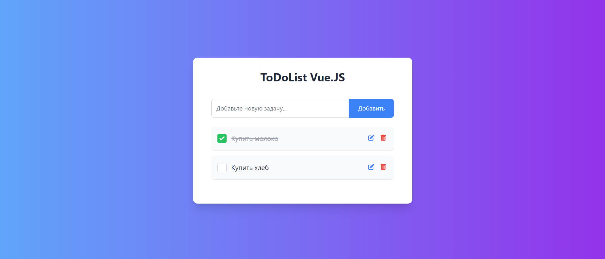

# TodoApp-Vue.JS (Vue.JS / Tailwind CSS / Pinia)

## Overview 🌟
This application is a simple and easy to use task list developed using modern technologies: Vue 3 (Composition API), Pinia for state management, Tailwind CSS for styling and Vite for project build.

### [Check the Live Demo](https://subbotinroman.github.io/TodoApp-Vue.JS/) 👈



***
## Stack ⚙️


***
## Features 🚀

- 🎯 Adding tasks: The user can enter the text of a new task and add it to the list.
- 📝 Editing tasks: A task can be edited by opening a modal window with an input field.
- ❌ Deleting tasks: Each task can be deleted with a single click on the trash can icon.
- ✅ Marking a task complete: You can mark a task as completed and the task text will be strikethrough.
- 📥 Saving tasks: All tasks are saved to localStorage so that they don't disappear after the page reloads.
- 💥 Vertical Scrolling: The task list supports convenient vertical scrolling if there are too many tasks for one screen.

***
## How to run locally

* install dependencies
```js
npm install
// or
yarn
```
* start local server via Vite
```js
npm start dev
// or
yarn dev
```


